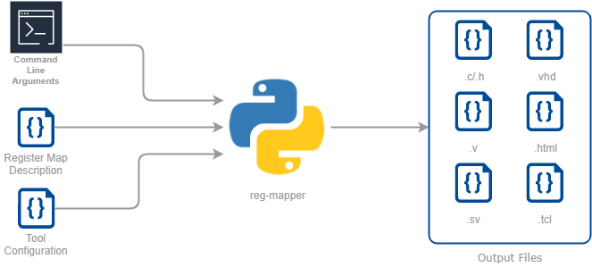

# reg-mapper
[](https://travis-ci.org/aappl/reg-mapper)
[](https://app.codacy.com/app/aappl/reg-mapper?utm_source=github.com&utm_medium=referral&utm_content=aappl/reg-mapper&utm_campaign=Badge_Grade_Dashboard)
[](https://codecov.io/gh/aappl/reg-mapper)

## Introduction
This project is in the early stages of development. Therefore, it is likely to change frequently.
It should be considered unstable until version 1.0.0.

reg-mapper is a python library for mapping registers in C, VHDL, Verilog etc.
It allows you to create a register map for a hardware module once,
then output that register map in various languages.
The different languages can be imported into different projects to synchronise communications.
For example, if you have an SoC system with a processor and some custom hardware,
you will want to create and maintain a register map that allows the two sides to communicate.

Traditionally, each team (hardware and software) has to create the register map in
their respective languages.
With reg-mapper, one person can create the register map, and then generate the code for each language needed.
This could be C and VHDL, or TCL and Verilog, and HTML for automatic documentation.
Each language can then be imported to the relevant project.

&nbsp; <!-- Add blank line -->



&nbsp; <!-- Add blank line -->

## Roadmap
The first version will allow the user to create the register map in YAML, and output in C and VHDL.
Then more output languages will be added:
- Verilog
- System Verilog
- HTML
- Markdown
- TCL (for interfacing with hardware over JTAG)
- Python (for creating regression tests)

Currently, the code uses a class to describe the register map, which is then passed to language creation
functions to output the register map in a particular language.
However I would like to move this to using the Mako templating library. I believe this will make it easier
to add new languages, and maintain current ones.

&nbsp; <!-- Add blank line -->

## Installing
This project uses [pipenv](https://pipenv-fork.readthedocs.io/en/latest/) and can be installed by cloning the repo, and running:
```
pip install pipenv
pipenv install --dev
```

&nbsp; <!-- Add blank line -->

## Running the tests
reg-mapper has a suite of regression tests that will be added to over time. They can be run with the following:
```
pytest
```
or with code coverage:
```
pytest --cov=./
```

&nbsp; <!-- Add blank line -->
